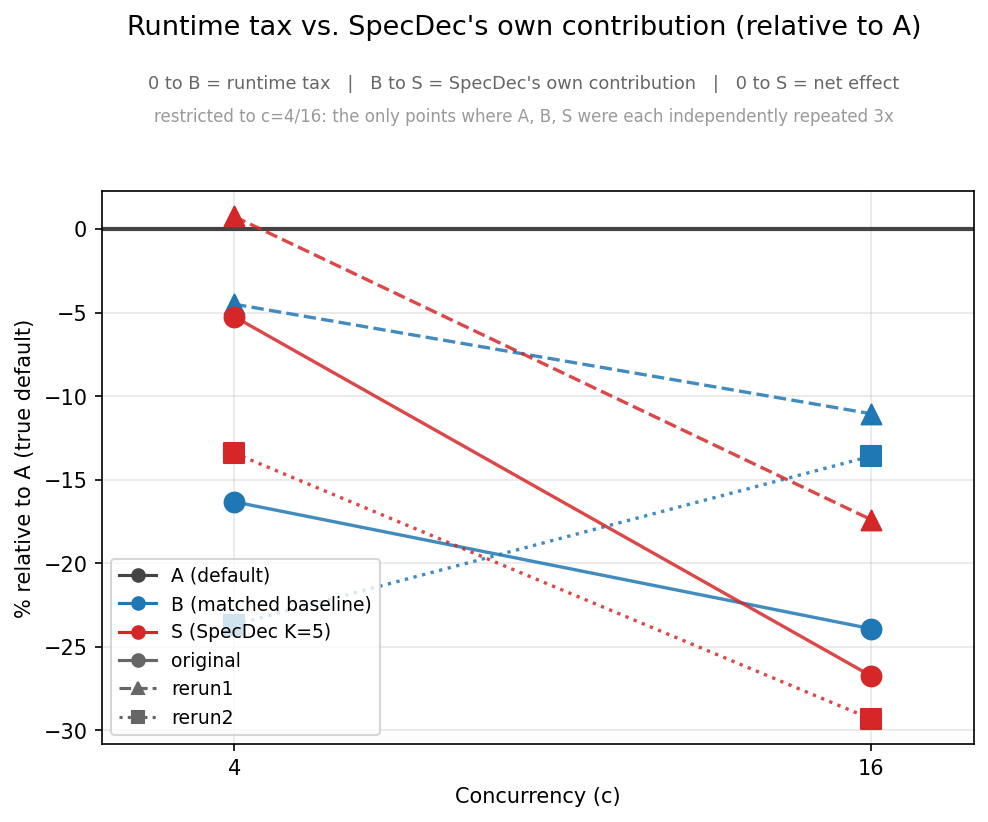
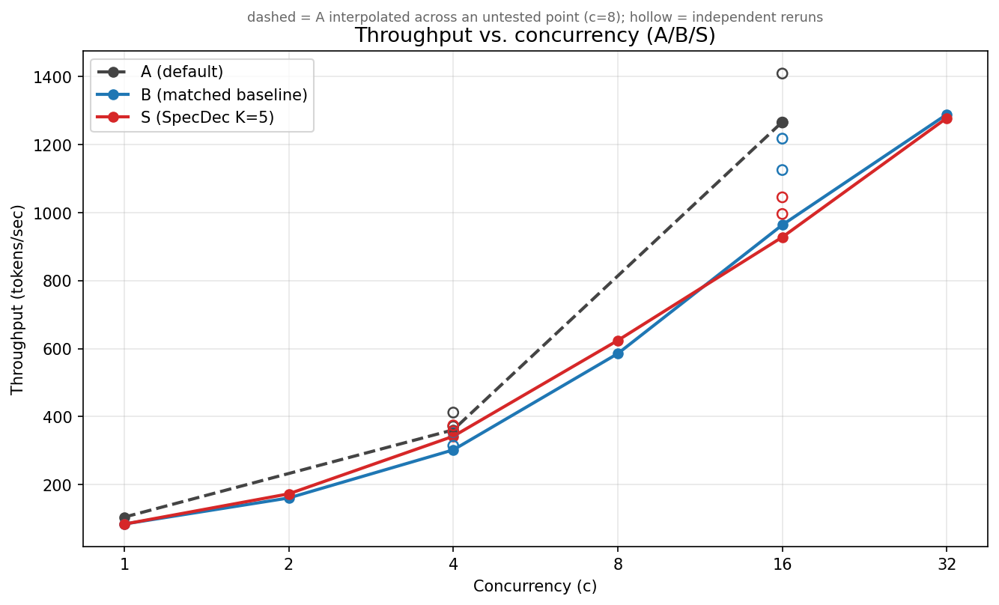
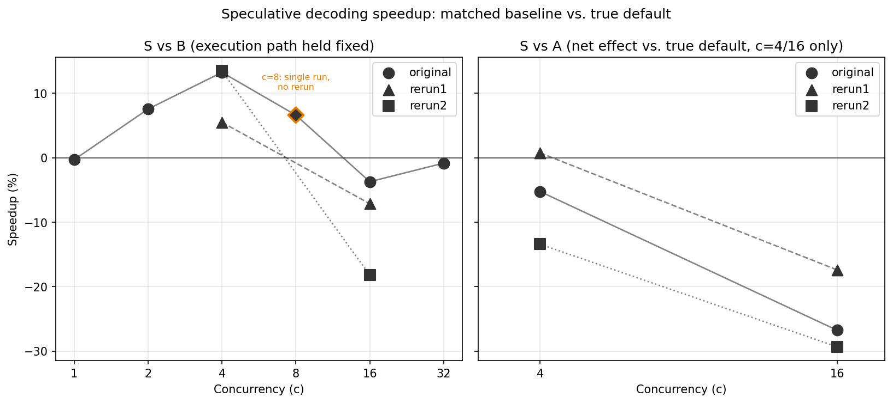

# Speculative Decoding on a Single Consumer GPU: When Does It Actually Pay Off?

在单张 RTX 5090 上，对 vLLM `draft_model` Speculative Decoding 进行 concurrency 1–32 的 measurement study，并同时与 matched baseline 和 true default vLLM 进行比较。

**Headline finding:** 在本实验测试的 concurrency 范围内，没有观察到 Speculative Decoding 能够稳定优于 true default vLLM。相对于控制了两个 known downgrade factors 的 baseline，SpecDec 在部分低至中等 concurrency 下能够获得可重复的 throughput gain；但这些收益没有稳定覆盖从 default configuration 切换后观察到的 runtime overhead。

---

## 1. Problem

Speculative Decoding（SD）的基本思路是使用 draft model 一次生成多个 candidate tokens，再由 target model 进行 verification，从而减少 autoregressive decoding 中必须串行执行的 step 数量。

对于单卡 LLM serving，我希望回答一个更具体的问题：

> 在单张 consumer-grade GPU（RTX 5090）上，使用固定 model pair 时，开启 vLLM `draft_model` Speculative Decoding 后，随着 concurrency 增加，实际 serving throughput 是否能够优于直接运行 default vLLM？

这里的 **default vLLM** 很重要。

如果只比较 SpecDec 与一个人为限制过的 baseline，很容易把 SpecDec 自身的效果与 runtime configuration changes 混在一起。因此，本实验同时保留 true default vLLM 作为 deployment-relevant baseline，并另外构造一个 matched baseline 用于分析 known configuration differences。

---

## 2. Setup

|            | Target model  | Draft model | GPU         |
| ---------- | ------------- | ----------- | ----------- |
| Model pair | Qwen3-14B-AWQ | Qwen3-0.6B  | 1× RTX 5090 |

Speculative configuration：

* `method=draft_model`
* `num_speculative_tokens=5`（K=5）
* `max_num_seqs=16`
* `max_model_len=8192`
* `gpu_memory_utilization=0.85`
* prefix caching disabled
* greedy decoding
* fixed short prompt（每个 response 约 77 output tokens）

我们定义三种 server configuration，由 `scripts/start_*.sh` 启动：

* **A — default vLLM.** 不开启 Speculative Decoding，也不加入 manual runtime override，代表用户直接运行 default vLLM 时的 configuration。
* **S — SpecDec.** 在 default launch configuration 上加入 `draft_model` Speculative Decoding，K=5。
* **B — matched baseline.** 不开启 Speculative Decoding，但手动复现开启 S 时从 startup behavior 中明确观察到的两个 configuration changes：Model Runner fallback 和 async scheduling disabled。

在本实验使用的 vLLM configuration 中，启动 `draft_model` SpecDec 后观察到 Model Runner fallback，同时 default async scheduling behavior 发生变化。因此，如果只比较 S 与 A，performance difference 至少会混合：

1. Speculative Decoding 所对应的 incremental effect；
2. 已知 runtime configuration changes 所对应的 overhead。

B 的作用是控制目前已经明确观察到的这两个 known downgrade factors。

因此：

* **S vs B**：观察在控制两个 known downgrade factors 后，开启 SpecDec 所对应的 incremental effect；
* **B vs A**：观察这两个 known downgrade factors 共同对应的 runtime overhead；
* **S vs A**：观察用户从 default vLLM 切换到当前 SpecDec configuration 后得到的最终 net effect。

需要强调的是，B **只控制目前已知的两个 configuration changes**。

它并不能证明 B 与 S 的内部 execution path 完全一致。开启 SpecDec 后，vLLM 内部仍可能存在其他尚未通过 source-code inspection 或 profiler 验证的 execution-path differences。

---

## 3. Measurement Protocol

对于每一个 concurrency `c`，`run_sweep.py` 依次执行：

1. local prewarm（不计入 measured window）
2. 启动 remote telemetry sampling
3. 运行 measured benchmark
4. 停止 telemetry
5. 保存 benchmark summary 与 telemetry results

Telemetry 由 `scripts/telemetry.py` 采集，sampling interval 约为 0.2 s，并读取 Prometheus `/metrics`。

Benchmark 由 `benchmark.py` 执行，使用 continuous-refill `ThreadPoolExecutor`，worker 数量等于 concurrency `c`，而不是 wave-barrier benchmark。

每个 condition / concurrency 使用：

* `min-runs=64`（c ≤ 16）
* c=32 使用更多 requests

### Timing definitions

所有 timing 均在 `benchmark.py` 中按 request 计算。

* **TTFT**：从 HTTP request 建立前开始计时，到收到第一个 streamed token 为止。
* **E2E**：从 request start 到最后一个 token 返回。
* **TPOT**：

  `(E2E − TTFT) / (completion_tokens − 1)`

这里的 TPOT 是 average decode-phase latency 的 approximation，而不是真正的 per-token Inter-Token Latency（ITL）。

当 `completion_tokens ≤ 1` 时，TPOT 返回 `None`，因为第一个 token 主要对应 prefill，而不是 decode。

Client 位于韩国，server 位于中国大陆，并通过 SSH tunnel 连接。因此 absolute TTFT / E2E 包含 cross-border network latency 与 tunnel overhead，不能直接解释成 server-internal latency。

### Speculative-Decoding metrics

通过 Prometheus counter 在 measured window 前后的 delta 计算：

* `acceptance_pct = 100 × accepted_tokens / draft_tokens`
* `mean_acceptance_length = 1 + accepted_tokens / drafts`
* `K_observed = draft_tokens / drafts`

其中 `K_observed` 用于 sanity check configured K=5。

### Queueing metric

定义：

`Wait% = 100 × (# active samples with vllm:num_requests_waiting > 0) / (# active samples)`

其中 active sample 定义为：

`running > 0 or waiting > 0`

因此 `Wait%` 是 **time-occupancy statistic**：

> 在多少比例的 sampled instants 中，至少存在一个 waiting request？

它并不是：

> 有多少比例的 requests 曾经经历 queueing？

这两个 quantity 含义不同。

### Independent reruns

B 和 S 在 c=4 与 c=16 上分别额外进行了两次 independent rerun，每次都重新启动 fresh server process。

因此 B / S 在这两个 concurrency 上共有：

* original
* rerun1
* rerun2

A 最初只测试了 c=1、4、16。

之后由于重新检查 analysis methodology 时发现 A 自身的 run-to-run variance 没有被测量，因此又独立重启并在 c=4 与 c=16 上补测了两次，使 A/B/S 在这两个 concurrency 上都有三次 independent measurement。

### Known dates

* B/S original sweep：2026-08-17
* A original + B/S rerun1/rerun2：2026-08-22
* A rerun1/rerun2：2026-08-24

不同 condition 从未在同一个 session / day 中同时测量。

详细影响见 §6 Limitations。

---

## 4. Main Result

**在测试的 concurrency 范围内，没有观察到 Speculative Decoding 能够稳定优于 true default vLLM。**

为了区分不同 effect，我们将结果拆成三个 layer。

### Layer ① — S vs B（known downgrade factors controlled）

这一比较用于观察：在控制 startup 时明确观察到的两个 known downgrade factors 后，开启 SpecDec 所对应的 incremental effect。

它并不意味着所有内部 execution-path differences 已经被完全消除。

| c      | 1     | 2     | 4          | 8      | 16        | 32    |
| ------ | ----- | ----- | ---------- | ------ | --------- | ----- |
| S vs B | -0.3% | +7.6% | **+13.2%** | +6.6%¹ | **-3.7%** | -0.8% |

在 c=2–8 范围内为 positive，并在 c=4 达到最大。

到 c=16 时 sign reversal。

在 c=4 与 c=16 的三次 independent measurement 中：

* c=4：+13.2% / +5.5% / +13.5%（3/3 positive）
* c=16：-3.7% / -7.1% / -18.2%（3/3 negative）

¹ c=8 只有一次 measurement，没有 rerun。

### Layer ② — B vs A（combined cost of the known downgrade factors）

| c      | 4（3 reruns）             | 16（3 reruns）             |
| ------ | ----------------------- | ------------------------ |
| B vs A | -16.3% / -4.5% / -23.7% | -23.9% / -11.1% / -13.6% |

在六组 paired measurement 中，B 均低于 A，差距约为 4–24%。

这一比较测量的是 B 中两个 known downgrade factors：

* Model Runner fallback
* async scheduling disabled

共同对应的 observed runtime overhead。

当前实验**没有单独隔离这两个因素各自的贡献**，也没有验证是否存在 interaction effect。

### Layer ③ — S vs A（deployment-relevant net effect）

每一个 S measurement 与 same-numbered independent A measurement 配对，而不是把所有 S rerun 都除以同一个固定的 A value。

| c  | Result                             |
| -- | ---------------------------------- |
| 1  | -19.7%（A 只测量一次，无法进行 rerun pairing） |
| 4  | -5.2% / **+0.75%** / -13.4%        |
| 16 | -26.8% / -17.4% / -29.3%           |

在 c=4：

* best case 约为 break-even（+0.75%）
* 3 个 pair 中 2 个明显为 negative

在 c=16：

* 3/3 均为 negative

### Correction note（2026-08-24）

早期 analysis 曾经将所有 S rerun 都与 A 的单次 original measurement 比较，并据此将 c=4 描述为 approximately tied / within noise。

之后对 A 进行了两次 independent rerun，发现 A 自身同样存在明显 run-to-run variance：

* A@c16：约 11% spread
* A@c4：约 14% spread

其量级与 B 的 variance 相比并不能忽略。

因此，使用同一个 A value 作为多个 S rerun 的固定 denominator 并不合理。

补测之后改为对 independent measurement 按 ordinal rerun tag 进行 pairing，并将最终结论收紧为当前版本。



*0 → B 表示 known downgrade factors 共同对应的 observed overhead。B → S 表示控制这些 known factors 后观察到的 incremental effect。0 → S 表示 relative to default 的 net effect。该图只展示 A/B/S 均有三次 independent measurement 的 c=4 与 c=16。*



*三种 condition 的 absolute throughput 与各自 run-to-run spread。A 在 c=8 没有 measurement，因此 c=4 与 c=16 之间的 dashed segment 只是 interpolation，不是 observed data。*



*Left：S vs B across the full concurrency sweep，其中 c=8 只有 single measurement。Right：S vs A，仅展示 c=4/16。Same-rerun points 相连，用于展示从 positive 到 negative 的 crossover trajectory。*

---

## 5. Mechanism

目前有两个 observation 支持 **compute-contention hypothesis**，同时可以降低一个比较直接的 alternative explanation 的可能性。

### Draft-model acceptance quality 没有随着 concurrency 明显下降

`acceptance_pct`（33.3%）和 `mean_acceptance_length`（2.67）在所有测试的 concurrency level 与 independent rerun 中都保持稳定。

如果更高 concurrency 导致 draft model 的 acceptance quality 明显下降，那么这些指标理论上应该随着 `c` 上升而下降。

当前实验没有观察到这种现象。

因此，**draft-model acceptance degradation 不太可能是 crossover 的主要解释。**

不过，这些 aggregate acceptance metrics 只能说明 acceptance-related behavior 保持稳定，并不能证明不同 load 下所有 speculative-execution behavior 都完全一致。

### Observed crossover 与 compute contention hypothesis 一致

在 c=4 时，不同 condition 的 average GPU utilization 约为：

**47–70%**

到了 c=16，则上升到：

**78–90%**

一种 plausible interpretation 是：

在较低 concurrency 下，SpecDec 增加的 draft / verification computation 可以使用原本没有被充分利用的 GPU resources。

随着 concurrency 提高、GPU 逐渐变得更加繁忙，这部分额外 computation 可能开始与正常的 batched decode workload 竞争 resources，从而使 SpecDec 的 incremental gain 减少甚至发生 sign reversal。

当前 aggregate GPU utilization data 与这一 hypothesis 一致。

但是，这些结果**不能建立 causal mechanism**。

要确认 crossover 具体来自哪个 execution stage、scheduler behavior 或 hardware resource bottleneck，还需要进一步进行 kernel-level profiling。

### Queueing detail

在所有 c ≤ 16 的 B/S sample 与 rerun 中：

`Wait% = 0`

因此 c=16 的 performance reversal **不能由当前 measurement 中观察到的 queueing 来解释**。

到了 c=32：

* `Wait%` 明显上升
* `vllm_waiting_capacity` 平均约为 8–9
* `vllm_waiting_deferred` 始终为 0

这一现象与 `max_num_seqs=16` 的 batch-size ceiling 开始生效是一致的。

因此，c=32 出现的 queueing 更可能是一个与 c=16 crossover 不同的 effect，而不是同一个 mechanism 的简单延续。

---

## 6. Scope and Limitations

### 1. Cross-date drift，且不同 condition 没有在同一 session 中测量

Measurement dates：

* B/S original：2026-08-17
* A original + B/S rerun1/rerun2：2026-08-22
* A rerun1/rerun2：2026-08-24

即使 Layer ③ 中使用 same-numbered rerun pairing，也只是按照 ordinal position 对 measurement 进行对应。

例如：

`A-rerun1 vs S-rerun1`

并不意味着它们发生在同一天或同一个 server session。

因此所有 independent value 都单独报告，而没有 collapse 成一个 mean / median。

### 2. Run-to-run variance 明显存在

例如：

* B@c16：964.0 / 1125.5 / 1217.9 tokens/sec（约 26% spread）
* A@c16：1267.1 / 1265.3 / 1409.4（约 11% spread）
* A@c4：361.0 / 371.3 / 412.0（约 14% spread）

实验最初假设 A 相对稳定，但补测之后发现 A 自身的 variance 也不能忽略。

因此，本 README 不将所有 measurement 简单 average 成一个 speedup number。

### 3. Run-to-run variance 的来源尚未确认

当前尚未将 variance 归因于：

* GPU clock behavior
* thermal behavior
* host-level noise
* runtime scheduling
* background process
* 或其他因素

这部分保留为 Future Work。

### 4. Single workload

当前实验使用：

* fixed short prompt
* 每个 response 约 77 output tokens

TTFT 约占 E2E 的 39%。

因此 decode 在 total request latency 中的占比相对有限，decode-time optimization 的收益可能被较大的 fixed prefill / request-side cost 稀释。

更长 output length 是否会改变 S vs A 的结果，需要独立测试。

### 5. Cross-border network path

Client 位于韩国，vLLM server 位于中国大陆，并通过 SSH tunnel 连接。

TTFT 从 HTTP request 建立之前开始计时，因此 absolute TTFT / E2E 包含：

* cross-border network latency
* SSH tunnel overhead

所以这些数值不能直接解释成 server-internal latency。

所有 condition 使用相同的 client-server route 和 tunneling setup，但不同 session 之间的实际 network conditions 没有被测量，也不能保证完全一致。

### 6. Matched baseline 只控制目前已知的 configuration changes

B 手动复现了开启 `draft_model` SpecDec 时明确观察到的两个 known downgrade factors：

* Model Runner fallback
* async scheduling disabled

当前还没有通过完整的 vLLM source-code inspection 验证，这两个因素是否已经覆盖所有由 SpecDec 引入的 execution-path differences。

因此：

**S vs B 应理解为在控制 known downgrade factors 后的 comparison，而不是对 Speculative Decoding 本身的 perfectly isolated measurement。**

### KV-cache note

开启 Speculative Decoding 后，本实验 configuration 中 reported KV-cache token capacity 从约：

**101,520 → 54,192 token-slots**

当前实验没有进一步 isolate 这一 capacity reduction 的 internal cause。

不过，在本次 short-context workload 中 measured peak KV utilization 很低：

* B：约 3%
* S：约 2.6%

即使在 c=32 也远未接近 capacity limit。

因此，这一 KV-cache capacity difference 没有成为本次 experiment 的 observed bottleneck。

它可能对 long-context deployment 更重要，但本实验没有针对该场景展开测试。

---

## 7. Future Work

### Separate the known runtime downgrade factors

当前 B 同时改变：

* Model Runner
* async scheduling

因此目前只能观察两者共同对应的 runtime overhead。

后续可以增加只改变其中一个 factor 的 control experiment，从而估计：

* Model Runner change 的独立影响
* async scheduling on/off 的独立影响
* 两者之间是否存在 interaction effect

### Verify the complete execution-path differences in vLLM

进一步检查：

* scheduler
* model runner
* Speculative Decoding
* memory / batch preparation

相关 source code，确认开启 `draft_model` SpecDec 后，除了目前已知的两个 configuration changes 之外，是否还存在其他 internal execution-path differences。

### Kernel-level mechanism verification

当前 compute-contention explanation 主要来自：

1. acceptance quality 没有随 concurrency 下降；
2. aggregate GPU utilization 随 concurrency 上升；
3. c=16 时没有 observed queueing。

这些 evidence 与 compute contention hypothesis 一致，但不是 kernel-level causal evidence。

后续可以使用 profiler 建立更完整的 chain：

`scheduler decision → execution behavior → GPU activity → throughput crossover`

### K sweep

计划测试：

`K = 1 / 3 / 7 × c = 1 / 4 / 16`

K 会改变 speculative work 与 potential accepted tokens 之间的 tradeoff。

需要回答：

> optimal K 是否随着 concurrency 改变？

以及：

> 较小的 K 是否能在低 concurrency 下减少 runtime overhead，使 S 更可能优于 A？

### Output-length sweep

当前 workload 的 decode share relatively low。

更长 output sequence 可以增加 decode step 的占比，因此需要测试：

> 更长 generation 是否能够 amortize fixed runtime overhead，并改变 S vs A 的 net effect？

### Run-to-run variance attribution

A/B/S 都观察到约 10–26% 的 throughput variance。

下一步可以在 benchmark window 中额外记录：

* GPU clock
* GPU temperature
* power
* host-level utilization

以检查这些 metric 是否与 performance variance 相关。

### Additional experiments

* additional draft-model sizes
* task diversity（chat / summarization / code）
* adaptive-K strategies
* longer-context workloads

---

## 8. Known Analysis Issue

### KV-cache metric bug in an earlier analysis script

早期 analysis script 使用的 telemetry column 为：

`vllm_kv_cache_usage_perc`

但 `telemetry.py` 实际记录的是：

`vllm_kv_cache_usage`

由于 missing key lookup 返回 `None`，因此早期 summary 中的 `kv_max_pct` 为空。

当前正式使用的：

`summarize_crossover.py`

已经使用正确的 metric name。

该问题影响的是早期 KV-cache summary，不影响：

* throughput
* TTFT
* TPOT
* E2E

等主要 measurement。

旧的 superseded scripts 仍保存在 `archive/` 中，仅作为历史记录，不用于当前 pipeline。

---

## 9. Repository Layout

```text
scripts/start_default.sh
# A: true default vLLM

scripts/start_matched_baseline.sh
# B: control for known downgrade factors
#    V1 runner, no async

scripts/start_specdec.sh
# S: draft_model SpecDec, K=5

scripts/telemetry.py
# remote GPU / vLLM metrics sampler

scripts/telemetry_controller.py
# start / stop wrapper invoked by run_sweep.py


benchmark.py
# client-side request / timing harness

run_sweep.py
# orchestrates:
# prewarm -> telemetry -> benchmark -> stop telemetry

summarize_crossover.py
# aggregates results/{summary,telemetry}
# -> results/crossover_summary.csv

plot_charts.py
# generates results/charts/chart{1,2,3}_*.png
# from crossover_summary.csv


results/summary/
# per-run benchmark JSON summaries

results/telemetry/
# per-run Prometheus before/after snapshots
# + sampled CSV

results/charts/
# charts referenced in this README

results/crossover_summary.csv
# flat table backing the reported numbers and charts


archive/
# superseded analysis scripts
# not used by the current pipeline
```

---

## Reproducing the Analysis

从已有 raw results 重新生成 summary 与 charts：

```bash
python summarize_crossover.py
python plot_charts.py
```

或者：

```bash
python summarize_crossover.py && python plot_charts.py
```
